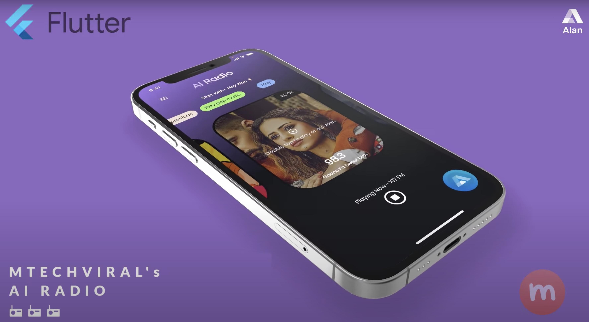
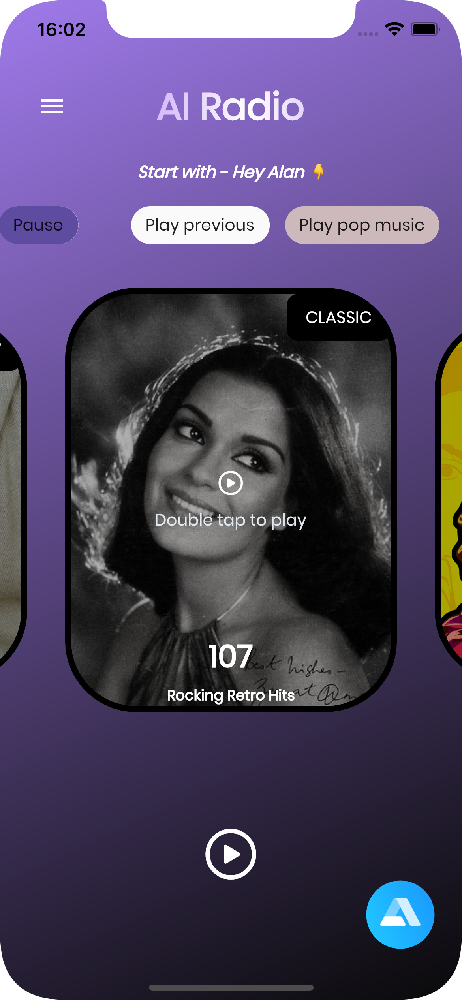
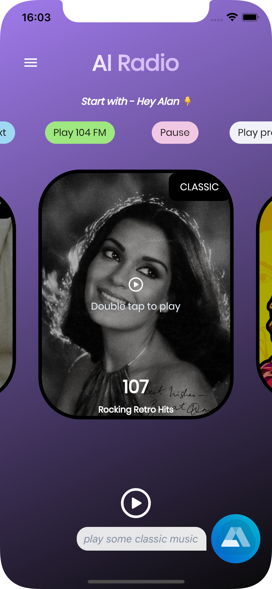

# AI-Powered Voice Assistant Flutter Radio App

This is a radio app where you can ask Alan AI to play some music.

  

> Alan AI: https://voice.alan.app/MTechViral
>
> Promo Code: MTECHVIRAL

## AI Radio Video Tutorial

[Watch here](https://youtu.be/p4xh7zTt6i0)

## Some screenshots

|                                      |                                      |
| ------------------------------------ | ------------------------------------ |
|  |  |
|   |   |
|   |

---

### :heart: Found this project useful?

If you found this project useful, then please consider giving it a :star: on Github and sharing it with your friends via social media.

---

## Project Created By

### Pawan Kumar

## Project Maintained By

### Usama Karim

## Getting Started

This project is a starting point for a Flutter application.

A few resources to get you started if this is your first Flutter project:

- [Lab: Write your first Flutter app](https://flutter.dev/docs/get-started/codelab)
- [Cookbook: Useful Flutter samples](https://flutter.dev/docs/cookbook)

For help getting started with Flutter, view our
[online documentation](https://flutter.dev/docs), which offers tutorials,
samples, guidance on mobile development, and a full API reference.
